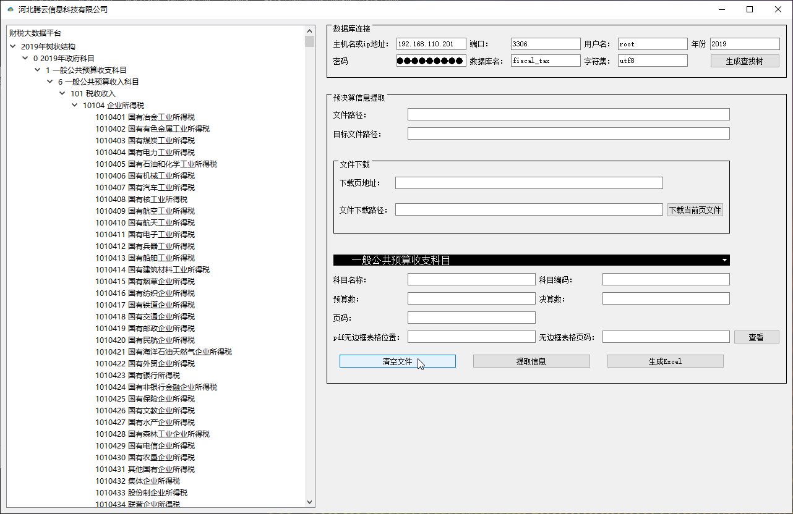

# 预决算信息提取器使用说明

# 1. 软件截图

## 2.数据库连接

* 1. 主机名或ip地址：数据库部署所在主机的ip地址。

  2. 端口：端口号默认一般为3306。

  3. 用户名：数据库用户名。

  4. 密码：数据库连接的密码。

  5. 数据库名：DB的名字。

  6. 字符集：根据数据库使用字符集填写。

  7. 年份：可以自行输入目前为2017、2018、2019、2020。

  8. 生成查找树Button：**如果需要按科目名称查找科目编码此为第一步操作，用来生成查找树（启动子线程渲染界面）**。

     

## 3. 预决算信息提取

* 1. 文件路径：需要解析文件的路径 **(双击弹出选择文件对话框)。**
  2. 目标文件路径：解析结果—预决算.xls存放路径**(双击弹出选择文件夹对话框)。**
  3. 下载页地址：包含文件.pdf、.doc[x]、xls[x]、.zip、.rar文件的url。
  4. 文件下载路径：下载文件存放路径**(双击弹出选择文件夹对话框)。**
  5. 下载当前页Button：启动子线程进行下载任务。
  6. 科目选择下拉框ComboBox：五大类、用于结果分类。
  7. 科目名称：可以是单个数字如1也可以同一行多个位置如1,3,5英文半角逗号隔开，指定科目名称所在列。
  8. 科目编码：可以是单个数字如1也可以同一行多个位置如1,3,5英文半角逗号隔开，指定科目编码所在列。
  9. 预算数：可以是单个数字如1也可以同一行多个位置如1,3,5英文半角逗号隔开，指定预算数所在列。
  10. 决算数：可以是单个数字如1也可以同一行多个位置如1,3,5英文半角逗号隔开，指定决算数所在列。
  11. 页码：可以是单个数字如1也可以同一行多个位置如1,3,5英文半角逗号隔开（**非连续页**），或者1-3（**连续页**）指定页码要以实际页码为准。
  12. pdf无边框表格位置：无边框表格的坐标左上角、右下角，先x横坐标后y纵坐标中间以逗号隔开如0,700,550,0。
  13. 无边框表格页码：可以输入单个页码 如5配合查看按钮使用。
  14. 查看Button：可以查看无边框表格的坐标左上角、右下角，先x横坐标后y纵坐标中间以逗号隔开如0,700,550,0。
  15. 清空文件Button：提取完一个单独城市、县、地区等的信息后提取下一个之前使用用来清除内存和文件。
  16. 提取信息Button：按输入进行信息提取。
  17. 生成Excel Button：预算数和决算数提取完毕后，直接生成可以用来上传的excel文件，名字为（预决算.xls）。
18. 页面信息 Button：可以查看当前页所提取文字的信息，防止pdf有合并单元格无法识别的问题。
  
  * **注：科目名称和科目编码不能同时非空**

# 4. 打包

* pyinstaller -F -w -i logo.ico mainwindow.py

# 5. 问题

* **Q: AttributeError: module 'camelot' has no attribute 'read_pdf'**

* A: uninstalling `camelot` and installing `camelot-py[cv]` solved the issue.

* **Q: Couldn't find path to unrar library**

* 1. 先到RARLab官方下载库文件，http://www.rarlab.com/rar/UnRARDLL.exe ，然后安装；
2. 安装最好选择默认路径，一般在 C:\Program Files (x86)\UnrarDLL\ 目录下；
  3. 然后重要的一步，就是添加环境变量，此电脑（我的电脑）右键，属性，找到 高级系统设置，高级 选项卡下点击 环境变量，在系统变量（注意不是用户变量）中 新建，变量名输入 **UNRAR_LIB_PATH** ，必须一模一样，变量值要特别注意！如果你是64位系统，就输入 **C:\Program Files (x86)\UnrarDLL\x64\UnRAR64.dll**，如果是32位系统就输入 **C:\Program Files (x86)\UnrarDLL\UnRAR.dll** ，这个从unrar安装目录的内容也能看出来它是区分64和32位的。
4. 确定保存环境变量后，重启你的PyCharm，代码不变，再运行就不会出错了。这个时候依赖库已经添加到系统环境中。
* **安装webdriver并配置环境变量**

* **Selenium隐藏控制台解决办法**

   一、起因：

    　　使用selenium 驱动浏览器的时候，如果使用headless模式，会有dos窗口弹出，输出监听信息，有时不想看到，很是麻烦。

  二、解决办法：

  　　修改源码：Lib \ site-packages \ selenium \ webdriver \ common \ _ services.py

  　　找到start()，如下图，添加配置参数 **creationflags=134217728** 即可

  

